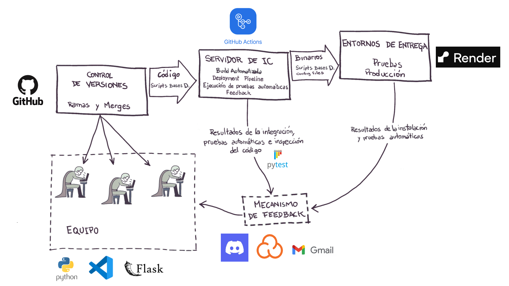

# Turnero Web - Taller de Integración Continua

Este proyecto forma parte del **Taller de Integración Continua**, y consiste en un sistema simples de turnos bancarios desarrollado con **Python (Flask)** y una interfaz visual en **HTML/JavaScript**.

El objetivo principal fue aplicar conceptos clave de integración continua como:

- Pruebas automatizadas con `pytest`
- Reportes de cobertura
- Análisis de código con **SonarCloud**
- Despliegue automático con **Render**
- Interfaz visual conectada al backend con HTML+JS 
- URL del proyecto: [https://nombre-del-proyecto.onrender.com](https://turneroci.onrender.com/)

---




## 📁 Instalación

1. Clonar el repositorio:

```bash
git clone https://github.com/tu_usuario/turnero.git
cd turnero
```
2. Instalar dependencias:

```bash
pip install -r requirements.txt
```
3. Iniciar servidor para ejecutar de forma local:

```bash
python app.py
```
4. Ejecutar pruebas y obtener cobertura de las pruebas

```bash
pytest --cov=turnero --cov-report=term
```


